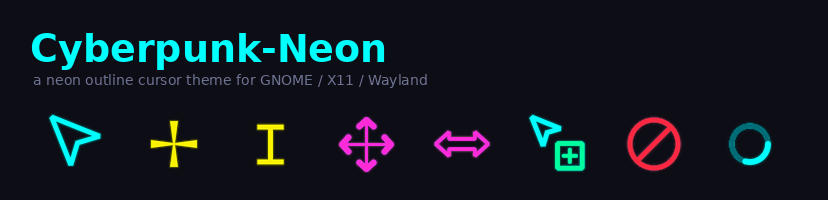
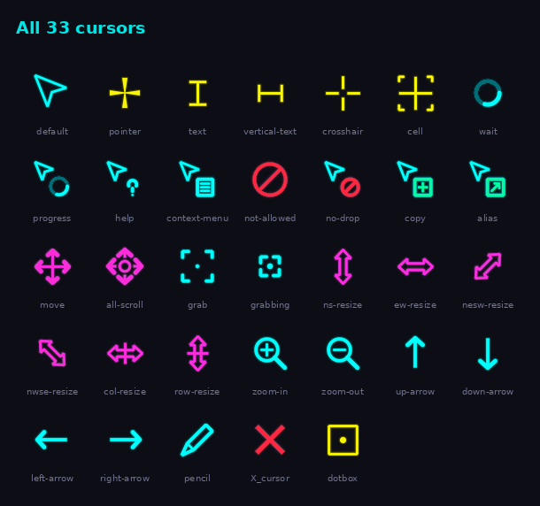
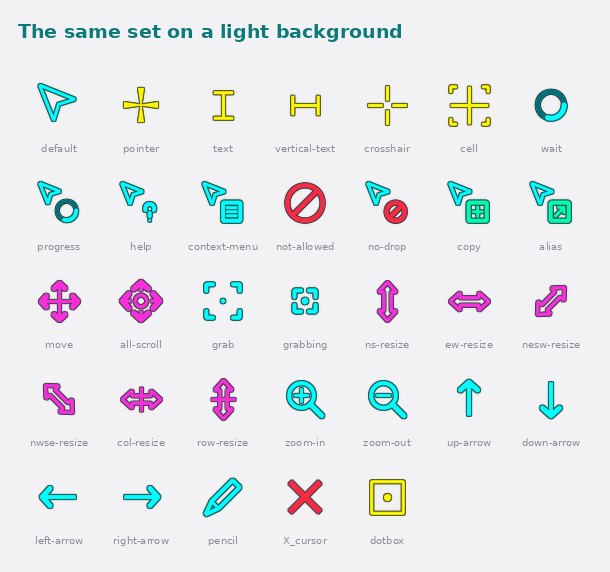
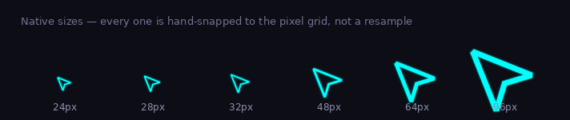

<div align="center">



**A neon outline cursor theme for GNOME, X11 and Wayland.**

Hard-edged cyan and yellow glyphs, no glow, transparent interiors, and a thin
per-hue edge that keeps them readable on light backgrounds.

[](LICENSE)
[](dist/)
[](#whats-included)

</div>

---

## Preview



Every glyph carries a 1px edge in a darkened shade of **its own colour** — dark
teal under cyan, dark olive under yellow — so the set stays legible on white
without a black outline stuck around it:



Six native sizes. Each is rendered and pixel-snapped on its own, not scaled from
a single master:



---

## Install

### Option 1 — download the archive (easiest)

Grab `Cyberpunk-Neon-1.0.0.tar.gz` from [`dist/`](dist/) (or from the Releases
page) and extract it into your icons directory:

```bash
mkdir -p ~/.icons
tar -xzf Cyberpunk-Neon-1.0.0.tar.gz -C ~/.icons
```

### Option 2 — clone and run the installer

```bash
git clone https://github.com/ayushkrsingh/cyberpunk-neon-cursors.git
cd cyberpunk-neon-cursors
./install.sh
```

`install.sh` copies the theme to `~/.icons`, mirrors it into
`~/.local/share/icons` (where GTK4 and some Wayland apps look), and applies it
via `gsettings`. Use `sudo ./install.sh -s` to install system-wide to
`/usr/share/icons` instead.

To remove it again: `./uninstall.sh`

### Option 3 — apply it by hand

After the theme is in `~/.icons`, pick it with either:

```bash
gsettings set org.gnome.desktop.interface cursor-theme Cyberpunk-Neon
```

…or **GNOME Tweaks → Appearance → Cursor → Cyberpunk-Neon**.

> Apps that cache their cursors at startup — some Electron apps, already-open
> terminals — need a restart before the change shows up.

---

## Setting the cursor size

```bash
gsettings set org.gnome.desktop.interface cursor-size 28
```

Or through the GUI:

| Where | Notes |
|---|---|
| **GNOME Tweaks** → Appearance → Cursor Size | A dropdown of preset sizes |
| **Settings** → Accessibility → Seeing → Cursor Size | Only a few coarse steps |
| `gsettings` | Any value — the finest control |

This theme ships native artwork at **24, 28, 32, 48, 64 and 96 px**. Pick one of
those: any other value gets resampled from the nearest one and loses the
pixel-snapped crispness. **28** is a good default, **32** if you like them
larger.

---

## Building from source

Requires Python 3 with [pycairo](https://pycairo.readthedocs.io) and
[Pillow](https://python-pillow.org), plus `xcursorgen`:

```bash
# Debian / Ubuntu
sudo apt install python3-cairo python3-pil x11-apps xcursorgen

# Fedora
sudo dnf install python3-cairo python3-pillow xorg-x11-apps
```

Then:

```bash
python3 src/generate.py              # build into ./Cyberpunk-Neon
python3 src/generate.py --install    # build straight into ~/.icons
python3 src/generate.py --out DIR    # build somewhere else
make                                 # build + previews + archive
```

Every glyph is drawn programmatically — there are no SVG or PNG source assets to
edit. Change a constant at the top of `src/generate.py` and rebuild; the whole
set regenerates in a few seconds.

| Knob | Does |
|---|---|
| `LW` / `BOLD` | Stroke weight, and the bump applied to everything but the arrow |
| `RIM` / `RIM_A` / `DARKEN` | Edge thickness, opacity, and how dark the per-hue shade goes |
| `PAD_PX` | Drawing margin — lower means bigger glyphs, but watch the edge check |
| `FILLC` | Interior body; alpha `0` is transparent, raise it for a tinted fill |
| `CYAN` `YEL` `MAG` `RED` `GRN` | The palette |

`src/make_previews.py` regenerates the images in `preview/` from the same code,
so they can never drift from what the theme actually looks like.

---

## What's included

**33 drawn cursors** plus **119 symlinked aliases**, covering the modern
freedesktop names (`default`, `pointer`, `ns-resize`…), the legacy X11 names
(`left_ptr`, `xterm`, `fleur`…) and the hashed GTK names (`e29285e6…`) that
Firefox, Chromium and Electron apps ask for — so nothing silently falls back to
a default arrow.

`wait` and `progress` are 12-frame animated spinners at 60 ms.

Colour carries meaning rather than being decorative:

| | |
|---|---|
| **cyan** `#00FFFF` | navigation — arrow, grab, zoom, spinner |
| **yellow** `#F9F002` | position and precision — pointer, text, crosshair, cell |
| **magenta** `#FF2BD6` | transform — move, all-scroll, every resize |
| **red** `#FF2740` | blocked — not-allowed, no-drop, X |
| **green** `#00FF9C` | affirmative — copy, link |

---

## Design notes

A few things that are less obvious than they look:

- **Stroke widths snap to whole device pixels** at each size, and axis-aligned
  glyphs are centred on the pixel grid, so edges land on pixel boundaries
  instead of straddling them and going soft.
- **The edge is derived from the finished glyph**, not stroked per shape. A
  darkened copy is spread outward one pixel and laid underneath. Stroking each
  shape separately left dark slivers in the gaps wherever two strokes
  overlapped — worst on `move` and `all-scroll`.
- **The margin is a fixed pixel count, not a fraction** of the canvas. The
  overhead it has to cover (the edge plus miter overhang) barely grows with
  size, so a proportional margin wasted 5–9 px at the large sizes while 24 px
  sat exactly at its limit.
- **The build verifies itself.** After every render it scans the canvas border
  and names any glyph whose ink runs off the edge; a clean build prints
  `edge check: clean`. That check found clipping on 23 of 33 cursors when it
  was first added.

One limitation worth stating plainly: Xcursor files are plain ARGB bitmaps that
get alpha-composited, and the format has no blend mode. A cursor that inverts
whatever is behind it is **not possible** — not here and not in any other theme.
The per-hue edge is the workaround.

---

## Credits

Designed from two reference screenshots, kept in [`reference/`](reference/) for
provenance. Built with [pycairo](https://pycairo.readthedocs.io),
[Pillow](https://python-pillow.org) and `xcursorgen`.

## License

[GPL-3.0](LICENSE) © [ayushkrsingh](https://github.com/ayushkrsingh)
